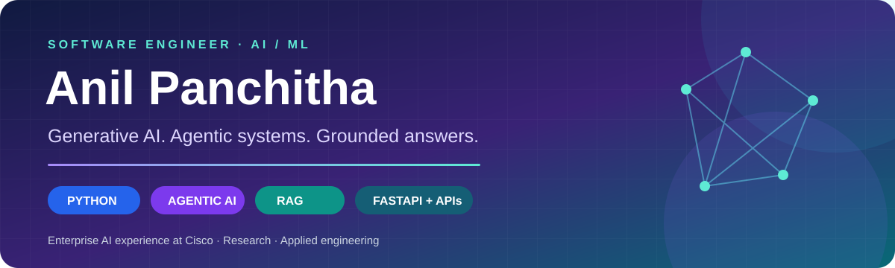

### Building intelligent systems from retrieval to real-world workflows.

## 🧑‍💻 About me

I'm **Anil Panchitha**, a software engineer focused on **Generative AI, agentic systems, and retrieval-augmented generation**, based in Hyderabad, India. I bring **one year of experience at Cisco Systems (Aug 2025–Aug 2026)** building AI and automation solutions for enterprise technical workflows.

My work connects language models with documents, tools, and APIs: from ingestion and retrieval to grounded responses, evaluation, and application services. I also explore multimodal document understanding, machine learning, and data analytics.

<table>
<tr>
<td width="33%" align="center"><b>🧠 GenAI & Agents</b> LLMs · Tool calling · RAG</td>
<td width="34%" align="center"><b>⚙️ Applied Engineering</b> Python · FastAPI · API integrations</td>
<td width="33%" align="center"><b>🔬 Evaluation & Research</b> Retrieval metrics · Explainable AI</td>
</tr>
</table>

## 💼 Experience

### Software Engineer · Cisco Systems
**August 2025 – August 2026 · Bangalore, India**

- Developed a **GenAI enterprise ITSM assistant** for documentation retrieval, troubleshooting, and operational guidance.
- Built RAG workflows spanning ingestion, chunking, embeddings, vector search, reranking, and grounded response generation.
- Integrated **ServiceNow and Cisco Meraki APIs** into Python automation and agent tool-calling workflows.
- Developed **FastAPI services** for inference, document processing, retrieval, and workflow integration.
- Evaluated retrieval and response quality with **Precision@K, Recall@K, MRR, and faithfulness**.

## 🚀 Selected work

### 🟣 Nexora AI · Agentic assistant with hybrid RAG
**Public project · [Explore code & setup →](https://github.com/Anilyadav1718/Agentic-AI-with-RAG)**

An assistant that routes requests to a calculator, web search, or PDF knowledge base. Combines semantic retrieval and BM25 through Reciprocal Rank Fusion, with ChromaDB storage and a Streamlit interface.

**Python · Groq / Qwen · Streamlit · Sentence Transformers · ChromaDB · BM25**

<b>🔎 Explore the agent workflow</b>

 

**Question → model → tool selection → tool result → grounded response**

- **Calculate:** arithmetic requests route to a calculator tool.
- **Search:** current-information questions can invoke web search.
- **Ask a PDF:** uploaded document questions use hybrid retrieval.
- **Inspect sources:** retrieved pages and ranking details are visible in the interface.

This is an engineering/demo project with local document storage, session-based memory, and API rate limits.

### 🔵 FarmerVerify AI · Multimodal document verification
**2026 · Cisco Tech Hackathon winner / You Amaze Award**

Built a document-verification workflow combining OCR, GPT-4.1 Vision, retrieval, validation rules, fuzzy matching, and fraud checks. Reduced onboarding time from **14 days to under 2 hours**.

**Python · FastAPI · GPT-4.1 Vision · OCR · RAG · REST APIs**

<b>🧩 Explore the eight-stage workflow</b>

 

**OCR → preprocessing → LLM/Vision inference → RAG retrieval → validation rules → fuzzy matching → fraud detection → decision support**

The system processes regional-language and image-based documents, using multimodal extraction and retrieval-based validation. FastAPI services orchestrate processing and downstream workflow execution.

### 🟢 CMS AI Assistant · Enterprise knowledge retrieval

An LLM-powered assistant for technical documentation and troubleshooting guidance. Uses **LangChain and ChromaDB**, metadata filtering, semantic retrieval, reranking, and evaluation across retrieval relevance and response faithfulness.

**Python · LangChain · ChromaDB · Embeddings · Reranking · LLM evaluation**

> FarmerVerify AI and CMS AI Assistant are professional project highlights. Public code is available for Nexora AI and the notebooks below.

<b>📊 Explore my machine learning & analytics portfolio</b>

 

| Project | Focus | Code |
| :--- | :--- | :--- |
| **Machine Learning Lab** | Personal income classification, loan prediction, hotel bookings | [Notebooks →](https://github.com/Anilyadav1718/ML_PROJECTS) |
| **Data & Insights** | Telangana, IPL batting, COVID-19 India, agriculture, Power BI | [Analysis →](https://github.com/Anilyadav1718/DATA-SCIENCE) |
| **Fake News Detection** | News classification notebook | [Project →](https://github.com/Anilyadav1718/CodeClause_Fake-News-Detection) |

## 🛠️ Technical toolkit

| Area | Skills & technologies |
| :--- | :--- |
| **🟣 Generative AI** | LLMs, AI agents, tool/function calling, prompt engineering, multimodal AI, LangChain, Google's ADK |
| **🔵 RAG & retrieval** | Ingestion, chunking, embeddings, ChromaDB, vector search, metadata filtering, hybrid retrieval, reranking |
| **🟢 Evaluation** | Precision@K, Recall@K, MRR, faithfulness, top-K and chunk-size analysis |
| **🟠 AI / ML** | Machine learning, deep learning, NLP, computer vision, OCR, TensorFlow, Scikit-learn |
| **⚙️ APIs & backend** | Python, SQL, JSON, FastAPI, REST APIs, OpenAI API, ServiceNow APIs, Cisco Meraki APIs, Postman |
| **📊 Data & development** | Pandas, NumPy, Jupyter, Git, GitHub, Power BI, Streamlit, cloud and serverless concepts |

## 🏆 Research & recognition

**Cisco Tech Hackathon 2026 — Winner / You Amaze Award**  
Recognized for an AI-powered document verification solution; featured on Cisco's official LinkedIn and X and recognized by Cisco Executive CX Leadership.

**Diabetic Retinopathy Detection Using Deep Learning**  
Springer · ICATECS · LNICST Volume 620  
EfficientNet-B1 transfer learning on IDRiD, compared with ResNet50 and InceptionResNetV2, with Grad-CAM for explainability.  
[**Read the publication →**](https://doi.org/10.1007/978-3-031-94283-9_21)

<b>🎓 Education & certifications</b>

 

**B.Tech · Computer Science and Engineering — Data Science**  
Institute of Aeronautical Engineering, Hyderabad · 2021–2024

- NPTEL Data Science Domain Scholar
- Machine Learning Specialization — Coursera
- Google Data Analytics Professional Certificate
- IBM Data Science Professional Certificate

---

### 🤝 Let's build useful AI

Interested in my work or an opportunity in AI/ML, GenAI, or software engineering?

